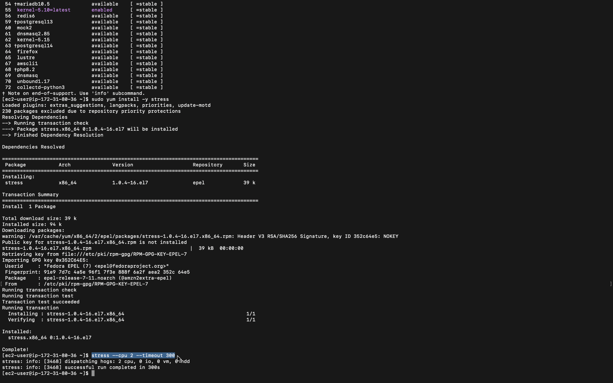
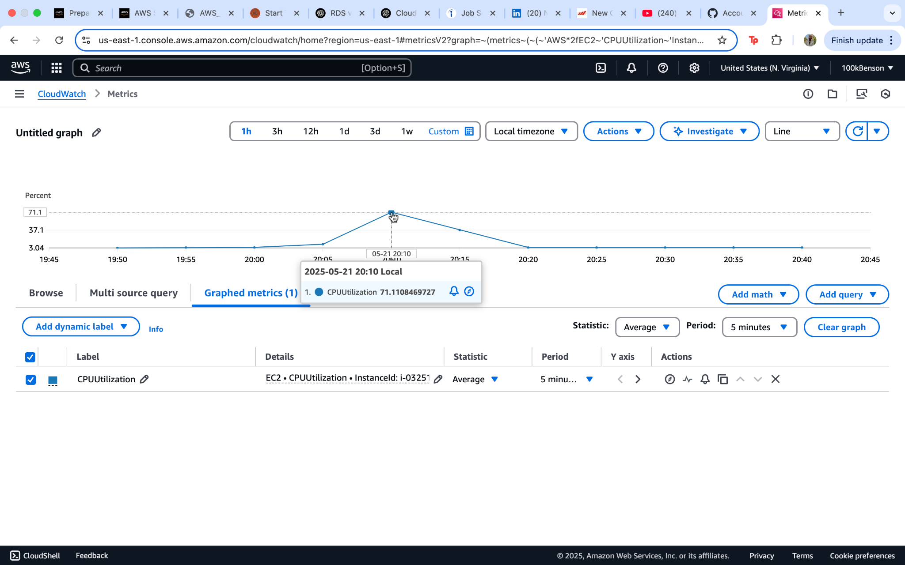
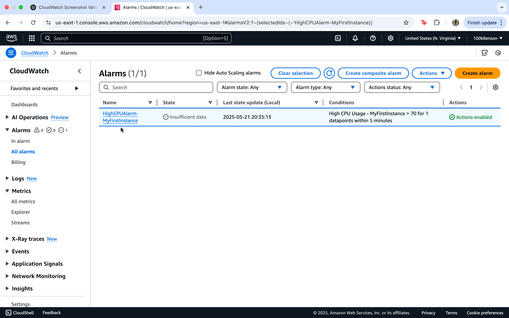
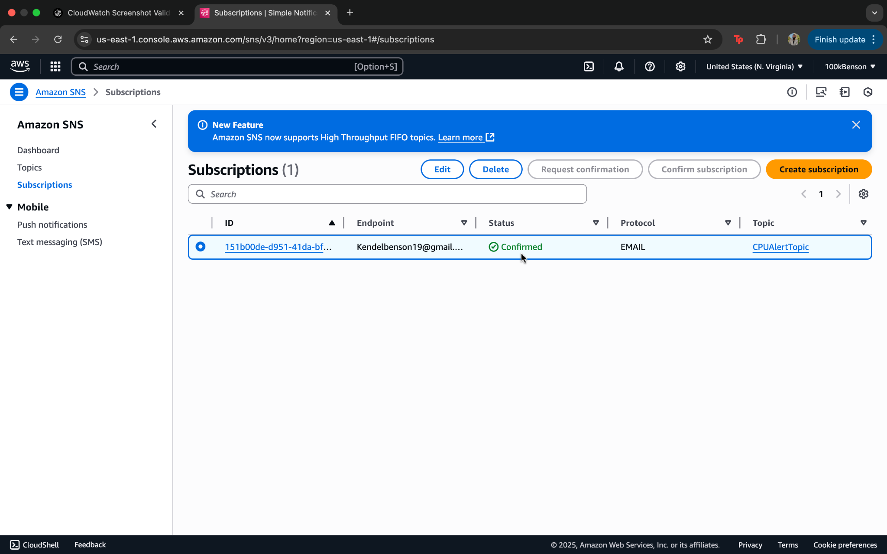

# AWS CloudWatch EC2 Monitoring Lab

This lab demonstrates how to monitor an EC2 instance using Amazon CloudWatch. It includes creating metrics, generating CPU activity, setting alarms, and configuring email alerts using Amazon SNS.

---

## 🚀 What I Did

### 1. Launched an EC2 Instance
- Created and connected to a Linux EC2 instance (`MyFirstInstance`) using SSH.

### 2. Monitored EC2 with CloudWatch
- Viewed default instance metrics like:
  - `CPUUtilization`
  - `EBSReadBytes`, `EBSWriteOps`, etc.
- Created a custom graph using **CloudWatch Metrics**.

### 3. Generated CPU Activity
- Installed and ran the `stress` tool:
  ```bash
  stress --cpu 2 --timeout 300
  ```
- Simulated high CPU usage to populate the CloudWatch metrics graph.

### 4. Created a CloudWatch Alarm
- Set an alarm for **CPUUtilization > 70%**.
- Configured it to trigger after 1 datapoint within 5 minutes.

### 5. Configured Email Notifications (SNS)
- Created an Amazon SNS topic (`CPUAlertTopic`)
- Subscribed my email to receive alerts.
- Confirmed the subscription via email.
- Linked the alarm to SNS for notification.

---

## 📸 Screenshots

### 1. EC2 Terminal - Stress Command
Command used to simulate CPU activity for testing.


### 2. CloudWatch CPU Utilization Graph
Shows the spike in CPU usage after running the stress test.


### 3. CloudWatch Alarm Setup
Alarm configured to trigger when CPU exceeds 70%.


### 4. SNS Email Notification Confirmation
Email subscription is confirmed for alert notifications.



---

## 🧠 Skills Practiced
- EC2 instance provisioning and access
- CloudWatch monitoring and visualization
- Resource alerting and SNS integration
- Basic shell/terminal usage

---

## 📫 Notifications
- Email is triggered when the CPU alarm threshold is breached
